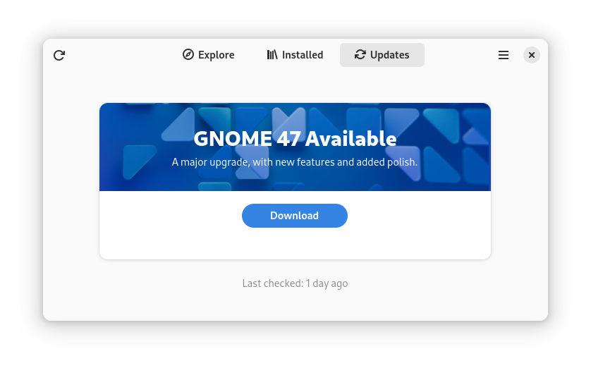
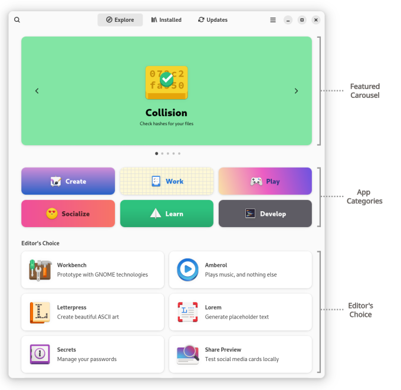

Vendor customisation of GNOME Software
======================================

GNOME Software is in an unusual position in a distribution, as it lies at the
interface of the GNOME project and the distribution’s packaging and release
infrastructure. GNOME Software is the user interface which a lot of users will
use to see updates and new releases from their distribution. Distributions
understandably want to be able to put some of their own branding on this
interface, both to publicise their distribution and to confer some level of
official authority on the updates being provided.

For this reason, GNOME Software has a few ways which vendors can use to
customise its appearance.

A variety of different customisations have been implemented in the past, some of
which have been removed and others are still present. This document aims to
document the ones which are still present and supported. This document is *not
necessarily complete*. It will be added to over time as different customisations
are refreshed and updated.

If there is a supported customisation method which is not in this document,
please [submit a merge request](https://gitlab.gnome.org/GNOME/gnome-software/-/merge_requests/)
to document it.

Likewise, if your distribution would like to customise GNOME Software in a way
which isn’t currently supported, please
[open a new issue](https://gitlab.gnome.org/GNOME/gnome-software/-/issues/)
to discuss it. We don’t guarantee to implement anything, and customisations are
limited to adding branding in specific areas.

Principles
----------

The principles which guide vendor customisation features in GNOME Software are:

| Principle | Rationale |
| ---- | ---- |
| Avoid requiring vendor specific code | Otherwise vendors have to maintain and test GNOME Software plugins, which is a lot of work. |
| Don’t use GSettings unless customisations really should be per-user. | While GSettings overrides are convenient, they are designed for user preferences, not packaging customisation. |
| Don’t require downstream patching of GNOME Software, although configure-time arguments are OK. | Many distributions are derived from other ones and would not like to have to maintain a packaging fork in order to make small customisations. |
| Be mindful of release cadences. | If customisations related to a new OS version were tied to the release cycle of GNOME Software, a new GNOME Software packaging release would have to be done by a distribution in advance of making their new OS release, which is a burden. It’s easier to allow distributions to put customisations specific to a new OS version into a separate package. |

Upgrade banner background image
-------------------------------

The background image which is shown when a new OS upgrade is available is
customisable in several ways. It’s displayed by the `GsUpgradeBanner` widget,
and shown on the Updates page. An example upgrade banner with
background image is shown below:



If your distribution has a specific GNOME Software plugin providing its upgrade
information, that plugin can provide CSS for rendering the background. See the
`fedora-pkgdb-collections` plugin for an example of this.

Otherwise, the background image is looked up from several well-known locations,
in order:
 * `${DATADIR}/gnome-software/backgrounds/${os_id}-${version}.png`
 * `${DATADIR}/gnome-software/backgrounds/${os_id}.png`

`${DATADIR}` is the configured data directory (typically `/usr/share`).
`${os_id}` is the `ID=` value from `/etc/os-release`, and `${version}` is the
version string being upgraded to.

Featured apps and Editor’s Choice
---------------------------------

There are several ways to promote and highlight specific apps in GNOME
Software. On the Explore page, there’s a carousel of featured apps
(`featured_carousel`), and an “Editor’s Choice” section (`box_curated`). Both of
them highlight curated sets of apps. The same is true on each category
page: a carousel (`top_carousel`) and an “Editor’s Choice” section
(`featured_flow_box`) are present. Category page is the page shown
when one of the app categories (`Create` / `Develop` etc) in the
Explore page is clicked. This is explained in the following image:



Both pages also have a “New & Updated” section (`box_recent` or
`recently_updated_flow_box`) presented below “Editor’s Choice”. The apps
listed in the new and updated section are not curated: they are chosen as the
apps which have had a recent release, according to the
`component/releases/release[@timestamp]` attribute in their metainfo.
Technically these are the results of a `GsPlugin.list_apps_async()` query with
`GsAppQuery:released-since` set.

Apps are included in any of the curated sets through having special
metadata in their metainfo. The required metadata is different for the different
sections:
 * Carousel on the Explore page: Apps are included if they have
   `component/custom/value[@key='GnomeSoftware::FeatureTile]` or
   `component/custom/value[@key='GnomeSoftware::FeatureTile-css]` set in their
   metainfo. They are also required to have a high-resolution icon, and the set
   of apps shown in the carousel is randomised and limited to (for
   example) 5. Technically these are the results of a
   `GsPlugin.list_apps_async()` query with `GsAppQuery:is-featured` set.
 * “Editor’s Choice” on the Explore page: Apps are included if they
   have `component/kudos/kudo[text()='GnomeSoftware::popular']` set in their
   metainfo. Technically these are the results of a `GsPlugin.list_apps_async()`
   query with `GsAppQuery:is-curated` set.
 * Carousel on the category page: Apps are included if they are in the
   `Featured` subcategory of the displayed category. They are also required to
   have a high-resolution icon, and the set of apps shown in the carousel
   is randomised and limited to (for example) 5.
 * “Editor’s Choice” on the category page: Apps are included if they
   meet the requirements for being in the carousel, but weren’t chosen as part
   of the randomisation process.

Example:
```xml
<?xml version="1.0" encoding="UTF-8"?>
<components>
  <component merge="append">
    <!-- The ID must always be present to allow merging -->
    <id>org.gnome.Podcasts</id>
    <!-- Make the app a candidate for inclusion in the carousel on the
         Explore page (if it has a hi-res icon). -->
    <custom>
      <value key="GnomeSoftware::FeatureTile">True</value>
    </custom>
  </component>

  <component merge="append">
    <!-- The ID must always be present to allow merging -->
    <id>org.gnome.Boxes</id>
    <!-- Include the app in the “Editor’s Choice” section on the Explore page. -->
    <kudos>
      <kudo>GnomeSoftware::popular</kudo>
    </kudos>
  </component>

  <component merge="append">
    <!-- The ID must always be present to allow merging -->
    <id>org.gnome.Builder</id>
    <!-- Make the app a candidate for inclusion in the carousel or
         “Editor’s Choice” section on category pages (if it has a hi-res icon). -->
    <categories>
      <category>Featured</category>
    </categories>
  </component>

<!-- more components -->
</components>
```

There are several ways to modify the metainfo for apps so that they are
highlighted as required, all of which involve providing an additional appstream
file which sets the additional metainfo for those apps.

There are 3 main approaches to providing these additional appstream files:

### 1. AppStream files via `gnome-app-list` package:

In this approach, a distro-specific appstream file is installed in
`${DATADIR}/swcatalog/xml` via `gnome-app-list` package, providing and
updating it via normal distribution channels.

If distributions wants to promote a different set of apps (than the
one provided by `gnome-app-list`), the recommended way is to provide
the additional AppStream file in a separate distribution package
(for example, `debian-app-list`). If the distribution already ships
the `gnome-app-list` package, the distribution package should mark
`gnome-app-list` as ‘conflicting’ with the distribution-specific package,
so the two cannot be installed at the same time.

Distributions should not patch the app list provided by `gnome-app-list`,
as that app list has been curated and endorsed by GNOME. Alternative
lists of promoted apps should be labelled with their curator, not GNOME.

### 2. AppStream files downloadable via remote URL:

For distributions which can’t do regular updates of individual files – such as
image-based distributions – GNOME Software can download distro-specific
appstream files from the internet. List them in the `external-appstream-urls`
GSetting in `/org/gnome/software`, typically via a distribution-provided
GSettings override. Each URL must be HTTPS, and must point to a valid appstream
file. GNOME Software must be configured with `-Dexternal_appstream=true` for
this to work.

GNOME Software will periodically check and download any updates to these
files, and will cache them locally. Ensure the `If-Modified-Since` HTTP header
functions correctly on your server, or GNOME Software’s caching will be
ineffective.

The `external-appstream-urls` mechanism may change in future.

### 3. AppStream files shipped with GNOME Software: (for testing purposes only)

GNOME Software ships a default list of featured apps, chosen to match
the [GNOME Circle](https://circle.gnome.org/). See
`data/assets/org.gnome.Software.Featured.xml` for this list, and for an example
of the metainfo XML needed to feature or highlight apps. See
`data/assets/org.gnome.Software.Curated.xml` for a default hard-coded list of
curated high quality apps, which is displayed in the “Editor’s Choice”
section of the Explore page.

Since GNOME 47, `gnome-app-list` is the recommended way to ship the
additional appstream files. AppStream files shipped with GNOME
Software should be used as an interim solution until `gnome-app-list`
or your distribution provided app list package (<a
href="#1-appstream-files-via-gnome-app-list-package">as explained
above</a>) is available in your distribution.

Pass `-Ddefault_featured_apps=true` when configuring GNOME Software to
enable the default list of featured apps. Pass
`-Dhardcoded_curated=true` to enable the default list of “Editor’s
Choice” apps. These options are enabled by default until GNOME 46, and
disabled by default from GNOME 47 onwards to actively discourage their
usage.

Deployment Featured Apps
------------------------

Deployments can feature their own apps, which will be shown in the Explore
page in its own section. To have the section shown, two files need to be provided.
The number of deployment-featured apps is limited in the UI, and if not enough
deployment-featured apps are found, then the section will not be shown at all.

The first file is `org.gnome.Software.DeploymentFeatured.xml`, which works similarly
to `org.gnome.Software.Featured.xml` and should be saved beside it in an appstream
directory. It sets the `GnomeSoftware::DeploymentFeatured` key on apps which should
be featured for this distribution or deployment. The value of this key is a string
containing the deployment name as an identifier.

The second file is `deployment-featured.ini`, which contains a human-readable title and
the selector for the section. The title is a localized key, and is used to set the heading
for the section on the Explore page. When the title is not provided, a fallback title
"Available for ${distro-name}" is used. The selector defines which apps should be picked.
It is a semicolon-separated list of `GnomeSoftware::DeploymentFeatured` key values, thus
the deployment can feature apps from zero or more vendors.

The `deployment-featured.ini` file should be saved in one of the `sysconfdir`, system
config dirs or system data dirs. They are checked, in that order, for existence of
the `gnome-software/deployment-featured.ini` file. The first directory containing
it will be used. The relevant file names are `/etc/xdg/gnome-software/deployment-featured.ini`,
`/usr/local/share/gnome-software/deployment-featured.ini` and
`/usr/share/gnome-software/deployment-featured.ini`.

Any changes to these files, including adding or removing them, will only be noticed
when GNOME Software is restarted.

Example files can be found in the `contrib/` directory.
